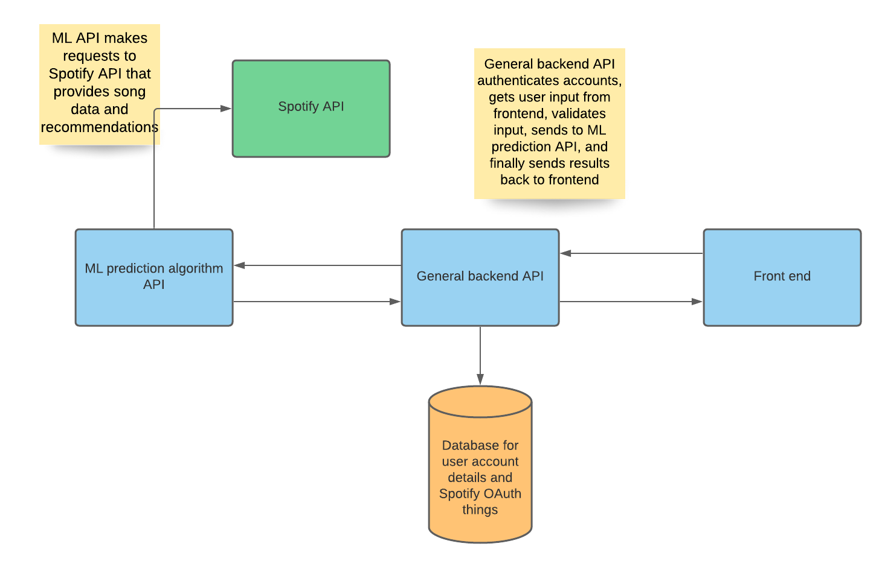
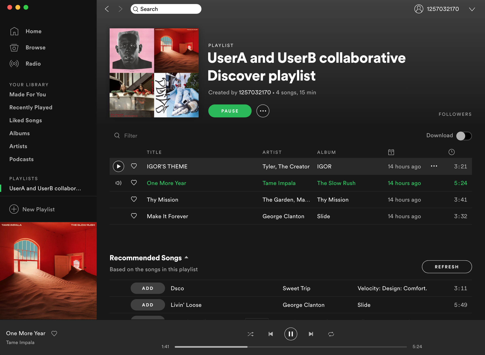

## Project Abstract






A web application that adds functionality to Spotify. The idea for this app is to make a collaborative playlist between two people. The idea is not for it to be manually created but to create a Discover playlist between two users and their music interests. A *Discover* playlist, if you are not familiar, is a weekly or daily playlist, generated by Spotify prediction algorithms, of songs that you might like based on your previous listening history. This could be created without a web app of course, but, a web app could provide a user interface for non-technical users.


TLDR:  Curate a Spotify Discover playlist between two users.


**Rough explanation:**

Spotify provides audio features of songs via [API](https://developer.spotify.com/). So the application might work something like the following. Get userA top listened to songs. Get userB top listened to songs. Get the features for both sets of songs. Perform some ML algorithm (tbd which one) to find the tracks between both users that are the most alike - because we're looking for similarity between userA set of music and userB set of music. Given that we have ranked/grouped both users most listened to songs, we can then feed those to Spotify forDevelopopers [recommendations](https://developer.spotify.com/documentation/web-api/reference/browse/get-recommendations/) endpoint and generate a list of songs. Lastly, we have the app create a new playlist in one of the two users' account and load the recommended songs into the playlist.


## Project Relevance

This project could be relevant for the following reasons:

- Backend API design
- Object-oriented design for the backend and perhaps frontend
- Interacting with web APIS (such as the Spotify API)
- API will use JSON and perform some of the CRUD operations
- Unit testing
- Access to Relational Database System


## Conceptual Design

This is not an existing open source project so the group will just create the web app from scratch as an open-source program. The bulk of the design and work would be on creating a backend API to gather data from the Spotify API, run algorithms, then publish or display results. Being a web app there will need to be a frontend interface. However, I imagine we can get away with a pretty basic frontend. The end result is a genereated playlist that has *merged* two users interests. The frontend would primarily be an interface to map two users and trigger the backend API. Finally, being a web app, the team could use a cloud platform to host the app which creates all kinds of other problems/challenges.


## Background

**URL:**

https://github.com/jakemcannon/3308_spotify_project


**Running:**

Currently, when you make any code changes you must stop your containers and start them again with this command for the changes to take effect. Next step is to look into solving this with live-reloading.

```
docker-compose up --build
```


**Stopping Docker containers:**

```
docker-compose down
```


**Manual Docker commands if compose is not working correctly**

Build the image

```
docker build -t flask_docker_demo .
```

Run the container

```
docker run -p 5000:5005 flask_docker_demo
```


## Other Resources

Similar site that deals with Spotify OAuth2 authentication and user-to-user matching. Not exactly the same since it does not *generate* playlists but similar in that it measures similarities between two users.

- https://musictaste.space/

Similar Spotify features/problems others have already sovled/worked on

- https://towardsdatascience.com/curating-a-spotify-discover-playlist-for-two-people-with-k-means-clustering-a926a9e1ec7d
- https://towardsdatascience.com/friendshipify-a-playlist-generator-for-friends-f79297f08b03


Creating ML API on AWS

- https://towardsdatascience.com/deploy-a-machine-learning-model-as-an-api-on-aws-43e92d08d05b
- https://medium.com/analytics-vidhya/build-and-deploy-an-machine-learning-model-using-aws-and-apis-1d22eadb2b83
- https://medium.com/datadriveninvestor/dockerize-and-deploy-your-machine-learning-application-on-aws-e2537bd3df21
